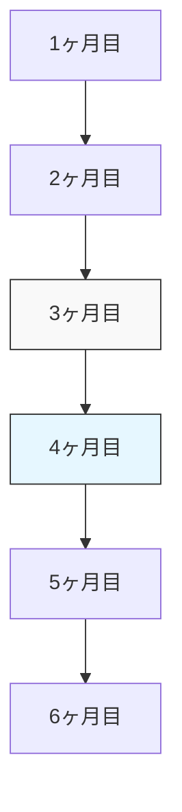

# CASTER BIZ assistant - 概要資料

## 優秀なアシスタントが忙しいあなたをサポートします
株式会社キャスター

---

## キャスターについて

- **2014年創業**
- **業界をつくってきたパイオニア企業**
- **ミッション：リモートワークを当たり前にする**

### 特徴
- ① フルリモート企業初の上場
- ② 5,500社導入(業界トップ)
- ③ 840名以上がフルリモート

---

## 会社概要

| 項目 | 内容 |
|------|------|
| 会社名 | 株式会社キャスター |
| 設立 | 2014年9月 |
| 代表者 | 中川祥太 |
| 本社 | 東京都千代田区大手町1-5-1 大手町ファーストスクエアウエストタワー 1・2F LIFORK大手町 R06 |
| 資本金 | 1億9061万円（2023年11月7日時点） |
| 事業許可番号 | 人材派遣事業 許可番号：派45－300149 有料職業紹介事業 許可番号：45－ユ－300088 |
| 株式 | 東京証券取引所グロース市場 |

*ISMS適用範囲：西都本社*

---

## なぜ この会社ができたのか？

### 従来の課題
- 採用(出社前提)が困難
- リモート採用はマネジメントが困難
- 人手不足で悩む企業と優秀な人材の架け橋のため

### キャスターの解決策
- 小ロット時間でアウトソーシング
- マネジメント不要
- リモートだからこそ採用できる優秀な人材

---

## キャスターのミッション

### リモートワークを当たり前にする

| 従来の働き方 | キャスターの働き方 |
|------------|-----------------|
| 正社員雇用がメイン | 業務委託契約がメイン |
| 高品質・高賃金 | 低品質・低賃金 |
| 自由なライフスタイル | 場所に縛られた生活 |

**～ 全国47都道府県・840名以上がフルリモートで活躍 ～**

---

## サービス概要「CASTER BIZ assistant」

- 月30時間で、幅広い業務の依頼ができます
- 15分以内にレスポンス＆ディレクション

### サービスの流れ
1. 貴社から業務依頼
2. フロント(ディレクター)がヒアリング＆作業者選定
3. キャスト(作業者)が作業・成果物を作成
4. Wチェック＆納品

---

## 強み❶ 優秀な人材プール

- 業界を作った知名度
- 1ヶ月の社員研修で合格したスタッフのみが対応
- アシスタント同士が競い合う環境

**毎月2,000名の応募の中から厳選された0.1%の正社員採用**

---

## 強み❷ 10年間で培った「フルリモートの業務推進ノウハウ」

**WEB会議でニュアンスをくみ取りながらマニュアル作成まで弊社が行うため、引継ぎが簡単・最速！**

---

## 強み❸ 「幅広い業務」に対応可能

**多様なスキルを持った 840名以上のアクティブメンバー**

### 対応可能業務一覧

| 事務 | 経理 | クリエイティブ | 外国語対応 |
|------|------|--------------|----------|
| □ 領収書整理 □ ファイリング □ 在庫管理・郵送 □ 書類仕分け | □ 経理記帳 □ 請求書・領収書発行 □ 請求・支払処理 □ 売上・入金確認 □ 紙伝票データ化 | □ ライティング □ 校正 / 校閲 □ 動画編集 □ Illustrator対応 □ Photoshop対応 | □ 海外とのメール対応 □ 翻訳業務 □ ビジネス文章の添削 □ リサーチ業務 |

| 訪問対応 | マーケティング | 採用 | 人事・労務 |
|---------|--------------|------|----------|
| □ 受電対応 □ スケジュール調整 □ 見積書・請求書作成 □ 営業資料作成 □ メール対応 | □ HP更新 □ バナー作成 □ SNS投稿画像作成 □ SNS投稿 □ いいねフォロー代行 | □ 求人票作成・更新 □ スカウト候補者選定 □ スカウト作成/送付 □ 応募者の日程調整 □ 内定者フォロー | □ 勤怠管理 □ 入社手続き □ 人事労務サポート □ データ入力 □ タイムカード管理 |

---

## CASTER BIZ assistantでは不可で、他サービスで可能なこと

### 採用
- □ 採用戦略の立案
- □ 媒体選定 ＆ 運用全般
- □ KPI管理 ＆ 専門チーム編成

### 人事・労務
- □ 業務フローの立案　
- □ 年末調整の全体推進

### 経理
- □ 専門知識を要する決算業務

### セールス・マーケ
- □ コンテンツマーケティング戦略/運用
- □ コミュニケーション戦略/運用
- □ 広告設計/運用

---

## ご利用料金

### BASIC 6ヶ月プラン
- **¥132,000/月** (税込 ¥145,200)
- 契約期間 : 6ヶ月
- 実働時間 : 30時間/月
- 時間延長 : 時間数 × 1.2
- 繰越し/ 前借り 手数料有 ¥500 / 時間 (税込¥550)

### BASIC 12ヶ月プラン
- **¥120,000/月** (税込 ¥132,000)
- 契約期間 : 12ヶ月
- 実働時間 : 30時間/月
- 時間延長 : 時間数 × 1.2
- 繰越し/ 前借り 手数料有 ¥500 / 時間 (税込¥550)

### OPTION
- ご要望に沿ってプランを作成

※月払い or 一括払い可能
※契約時間の翌月の繰越可能　＊翌月まで。事務手数料1時間あたり550円（税込）
※時間延長時は打診頂き、合意のもと時間延長オプション料金（時間単価×1.2倍）が加算

---

## 割増料金なし（開始後３ヶ月）

- 超過利用：30時間/月（契約時間）
- 翌月ご請求（1時間単位）
- 適切な時間を見極めていただけるように**開始3ヶ月間は割増料金はかかりません**
- 4ヶ月目以降は時間単価の1.2倍でご利用可能です

---

## サービス基本仕様

---

## トライアルキャンペーン(30時間)

### 【先着10社様限定】30時間お試しプラン
- □ 利用時間・料金：30時間 / 132,000円 (税別)
- □ 使用期間：1カ月
- □ 募集社数：先着10社様 / 月
- □ 条件：事例協力を依頼した際に,ご協力いただけること ※導入時と導入3か月後（計2回）

---

## サービス導入までの流れ

**最短５営業日で、利用開始が可能**

 